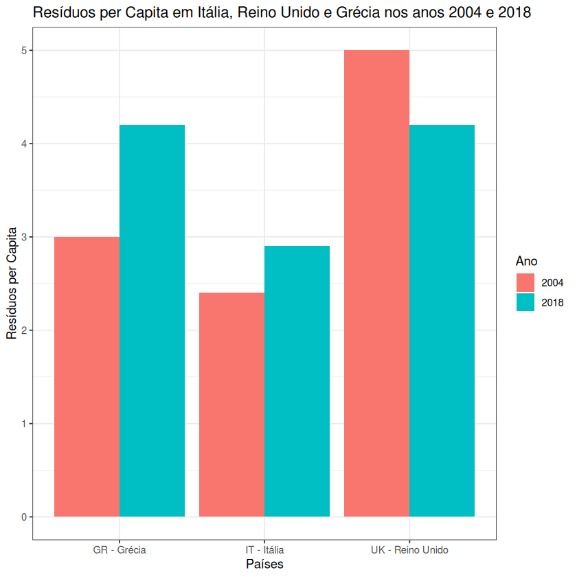

# Exercício 1 - Projeto Computacional PE 2022 (Diogo Gaspar)

O objetivo deste exercício é representar, através de um diagrama de barras, a produção de _resíduos per capita_ nos países `IT- Italia`, `UK - Reino Unido` e `GR - Grecia`, nos anos 2004 e 2018. Para tal, recorreu-se ao seguinte trecho de código `R` (utilizando as bibliotecas `openxlsx, ggplot2, dplyr` e `tidyr`):

```r
df <- read.xlsx("assets/ResiduosPerCapita.xlsx", sheet = 1, rows = seq(11, 43), cols = seq(1, 3))
df <- rename(df, "Países" = "Anos", "2018" = "┴.2018")
df <- df[df$"Países" %in% c("IT - Itália", "UK - Reino Unido", "GR - Grécia"), ]
df <- gather(df, key = "Ano", value = "Resíduos_per_Capita", 2:3)

ggplot(df, aes(x = Países, y = Resíduos_per_Capita, fill = Ano)) +
  geom_bar(stat = "identity", position = position_dodge()) +
  theme_minimal() +
  labs(x = "Países", y = "Resíduos per Capita") +
  ggtitle("Resíduos per Capita em Itália, Reino Unido e Grécia nos anos 2004 e 2018")
```

Observando o gráfico produzido pela chamada a `ggplot`, podemos notar que a quantidade de _resíduos per capita_ produzidos em Itália e na Grécia aumentaram no intervalo temporal em questão, diminuindo, por outro lado, no Reino Unido. Mais ainda, o Reino Unido passou de ser o maior produtor de _resíduos per capita_ por larga margem para estar empatado com a Grécia (enquanto que a Itália continua muito longe dos outros dois países).


