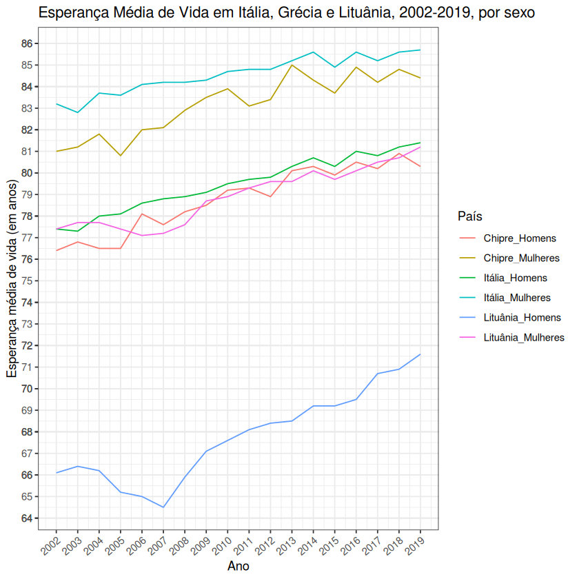

# Exercício 2 - Projeto Computacional PE 2022 (Diogo Gaspar)

O objetivo deste exercício é representar, através de um gráfico temporal, a evolução da Esperança Média de Vida nos países `IT- Italia`, `CY - Chipre` e `LT - Lituania`, entre os anos 2002 e 2019. Para tal, recorreu-se ao seguinte trecho de código `R` (utilizando as bibliotecas `openxlsx, ggplot2, dplyr` e `tidyr`):

```r
df = read.xlsx("assets/EsperancaVida.xlsx", sheet = 1, rows = seq(9, 73), cols = seq(1, 250))
df <- data.frame(df, row.names = 1)
df <- df[, c(42, 54, 56, 76, 88, 90)]
df <- rename(df, "Itália_Homens" = "IT...Itália.1", "Chipre_Homens" = "CY...Chipre.1", "Lituânia_Homens" = "LT...Lituânia.1")
df <- rename(df, "Itália_Mulheres" = "IT...Itália.2", "Chipre_Mulheres" = "CY...Chipre.2", "Lituânia_Mulheres" = "LT...Lituânia.2")
df <- df[as.character(seq(2002, 2019)), ]
df <- gather(df, key = "País", value = "Esperança_Média_Vida", 1:6)
df["Ano"] = rep(seq(2002, 2019), 6)

ggplot(df, aes(x = Ano, y = Esperança_Média_Vida, colour = País)) +
  geom_line() +
  labs(x = "Ano", y = "Esperança média de vida (em anos)") +
  ggtitle("Esperança Média de Vida em Itália, Grécia e Lituânia, 2002-2019, por sexo") +
  theme_bw() +
  theme(axis.text.x = element_text(angle = 40, hjust=1)) +
  scale_x_continuous(breaks = round(seq(2002, 2019, 1))) +
  scale_y_continuous(breaks = round(seq(40, 90, 0.5)))
```



Observando o gráfico produzido pela chamada a `ggplot`, podemos notar que a evolução da Esperança Média de Vida entre países foi semelhante: a maioria teve "picos descendentes" por volta de 2005-2007, sendo a evolução maioritariamente crescente a partir daí. Tanto inicialmente como no final, a porção de população com menor esperança de vida são os homens lituanos, estando as mulheres italianas no extremo oposto.
