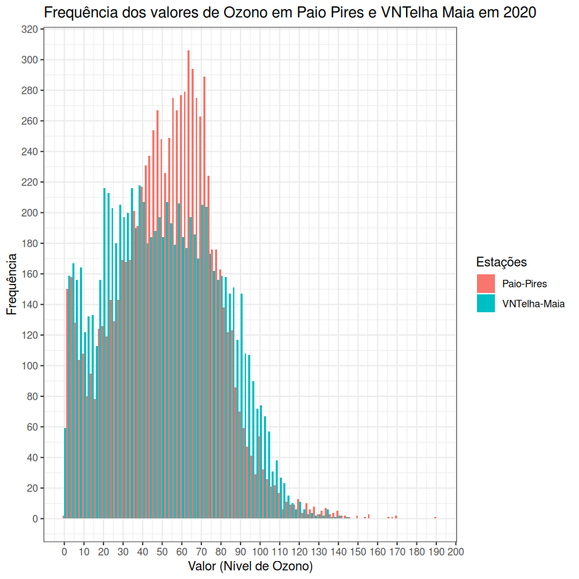

# Exercício 3 - Projeto Computacional PE 2022

O objetivo deste exercício é representar, através de um histograma, os valores dos níveis de ozono registados em 2020 nas estações de `Paio-Pires` e `VNTelha-Maia`. Para tal, recorreu-se ao seguinte trecho de código `R` (utilizando as bibliotecas `openxlsx, ggplot2, dplyr` e `tidyr`):

```r
df = read.xlsx("assets/QualidadeARO3.xlsx", sheet = 1)
df <- type.convert(df, as.is = TRUE)
df <- df[, c("Paio-Pires", "VNTelha-Maia")]
df <- pivot_longer(df, "Paio-Pires":"VNTelha-Maia")
df <- rename(df, Estações = name)

ggplot(df, aes(x = value, fill = Estações)) + 
  geom_histogram(binwidth = 4, position = position_dodge()) +
  theme_bw() +
  scale_x_continuous(breaks = round(seq(0, 200, 10), 5)) +
  scale_y_continuous(breaks = round(seq(0, 1000, 20), 5)) +
  labs(x = "Valor (Nível de Ozono)", y = "Frequência") +
  ggtitle("Frequência dos valores de Ozono em Paio Pires e VNTelha Maia em 2020")
```



Observando o gráfico produzido pela chamada a `ggplot`, podemos notar que os valores mais frequentes rondam o intervalo de 50 a 75 microgramas em Paio Pires, havendo uma descida súbita ao sair desse intervalo. Mais ainda, vê-se um pico relativamente anormal nos 10 microgramas, algo que também se nota em VNTelha Maia. Nessa estação, os valores parecem ter uma distribuição mais coesa, sendo a sua frequência relativamente semelhante entre os 25 e os 75 microgramas. Para ambas as estações, a frequência de valores acima dos 130 microgramas é praticamente negligenciável.