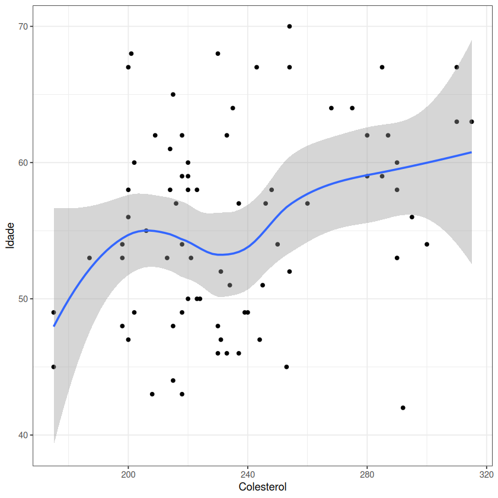

# Exercício 4 - Projeto Computacional PE 2022

O objetivo deste exercício é procurar ilustrar, através de um gráfico de dispersão, uma possível correlação entre a Idade e o Colesterol de um conjunto de 76 utentes de um serviço de saúde. Para tal, recorreu-se ao seguinte trecho de código `R` (utilizando as bibliotecas `openxlsx` e `ggplot2`):

```r
df <- read.xlsx("assets/Utentes.xlsx", sheet = 1)
df <- type.convert(df, as.is = TRUE)

ggplot(df, aes(x = Colesterol, y = Idade)) +
  geom_point() +
  geom_smooth() +
  theme_bw()
```



Observando o gráfico produzido pela chamada a `ggplot`, podemos observar que aparenta haver uma concentração algo forte de utentes com valores de colesterol entre os 200 e 240, começando, para fora desse intervalo, a haver um número mais esparso de utentes. Mais ainda, olhando para a curva ilustrada no gráfico, aparenta haver uma relação (ainda que não muito forte) entre a idade e os valores de colesterol dos utentes: à medida que a idade avança, os níveis de colesterol vão, em média, aumentando gradualmente.
